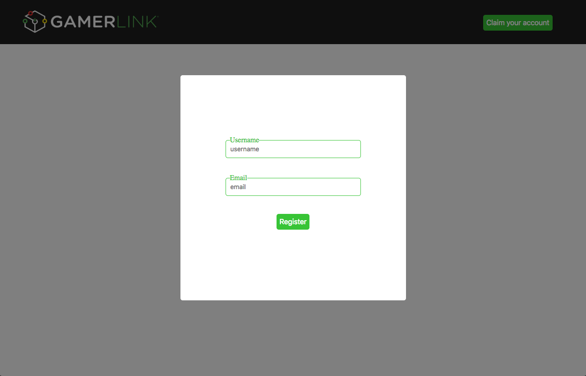

## User login page prototype built for "GamerLinkLFG.com"

This is a prototype of the user login page built specifically for GamerLink.gg.

**The project is built entirely in React.js**
****

On the current GamerLink website, the user is redirected to a new page after clicking on "Claim account" button after typing in their username, forcing user to click on "email" input field to complete registration. The extra click is redundant in my opinion .

**Current implementation:**
- click 1: click on username, type in, click claim account.
- click 2: click on email field, type in, hit enter to finish registration.

****

I optimized the user experience by grouping the "username" and "email" input field together, so it requires only 1 click to register account, then be redirected to the download page.

On top of better user experience, the login page will pop-up **with cursor auto-focused on username field** after "Register" is clicked.

**My implementation in React.js**
- click 1: click on "Register", cursor auto-focused on "username" field.
(type username -> press TAB -> type email -> press TAB -> press ENTER)

Prototype screenshot:

****

## Run the demo on your local machine

You need to have npm installed.

In the terminal, make an empty directory so you can delete the demo after finish viewing it. Then execute the following commands:

`git clone https://github.com/mhijack/gamerlink-demo.git`

`cd gamerlink-demo`

`npm install`

`npm start`
